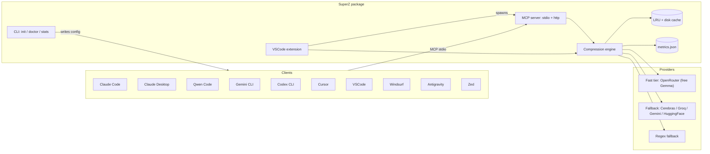

# Prompt Compressor (SuperZ)

> One command, every AI tool. Compress verbose prompts into dense technical
> instructions, save 30–80% of your tokens, and never drop a negative
> constraint again.

Prompt Compressor is a Model Context Protocol (MCP) server + universal
installer + VSCode extension. It compresses prompts by *racing* multiple
providers in parallel and integrates in one command with every major AI coding
tool.

The default strategy is now **Free-first**: `OpenRouter` with
`google/gemma-4-26b-a4b-it:free` is primary, with optional paid providers as
fallbacks only.

## Why it matters

| Problem                                        | What SuperZ does                                                   |
| ---------------------------------------------- | ------------------------------------------------------------------ |
| Prompts waste tokens on filler words           | Rewrites them in telegraphic, symbol-heavy style                   |
| LLMs sometimes drop "not" / "never" constraints| Validates every compressed output and falls back if a negation is lost |
| Teams want low cost by default                 | Free-first routing (`OpenRouter` free model first, paid fallback optional) |
| Each tool has its own MCP config file          | `npx prompt-compressor init` writes them all idempotently          |
| Different rules files per tool                 | Generates `CLAUDE.md`, `GEMINI.md`, `QWEN.md`, `AGENTS.md` from one template |
| No visibility into what's actually saving you tokens | Built-in metrics + `superz stats` + status-bar tokens-saved counter |

## Quick start

```bash
npx prompt-compressor@latest init
```

That's it. The installer detects every MCP-compatible tool on your machine
and wires up the compressor for each. Restart the affected apps and the
`compress_prompt` tool is available everywhere.

During `init`, the installer now offers interactive provider onboarding:
users can paste their API key and model once, and SuperZ stores it in the
user config file (`~/.superz/config.json` or `%APPDATA%\\SuperZ\\config.json`)
so no manual `.env` editing is required.
When OpenRouter setup is enabled, `init` can fetch live model listings from
OpenRouter and let users choose from available models directly (free models
prioritized).

## Supported integrations

All of the following speak MCP, so the installer handles them uniformly:

| Tool                 | Auto-detect | Config written                                  | Rules file     |
| -------------------- | :---------: | ----------------------------------------------- | -------------- |
| Claude Desktop       | Yes         | `claude_desktop_config.json` (platform path)    | —              |
| Claude Code CLI      | Yes         | `~/.claude.json`                                | `CLAUDE.md`    |
| Cursor               | Yes         | `~/.cursor/mcp.json`                            | `.cursor/rules/prompt-compressor.mdc` |
| VSCode (Copilot/Continue) | Yes    | `.vscode/mcp.json` or user `mcp.json`           | —              |
| Continue.dev         | Yes         | `~/.continue/config.yaml`                       | —              |
| Windsurf             | Yes         | `~/.codeium/windsurf/mcp_config.json`           | —              |
| Gemini CLI           | Yes         | `~/.gemini/settings.json`                       | `GEMINI.md`    |
| Qwen Code            | Yes         | `~/.qwen/settings.json`                         | `QWEN.md`      |
| Codex CLI (OpenAI)   | Yes         | `~/.codex/config.toml`                          | —              |
| Antigravity          | Yes         | Antigravity user `mcp.json`                     | —              |
| Zed                  | Yes         | `~/.config/zed/settings.json`                   | —              |
| Anything else        | Fallback    | —                                               | `AGENTS.md`    |

Plus the dedicated VSCode/Cursor/Antigravity [extension](./extension/README.md).

## CLI

```bash
# Interactive wizard
superz init

# Non-interactive, install everywhere we can detect
superz init --yes --all

# Preview without touching the filesystem
superz init --dry-run

# Only specific tools
superz init --only cursor claude-code gemini-cli

# One-off install / uninstall
superz add cursor
superz remove qwen-code

# Sanity-check every provider and every client config
superz doctor

# Show cumulative metrics
superz stats

# Serve MCP directly (stdio by default; HTTP for remote use)
superz serve
superz serve --http --port 7420 --token $SUPERZ_HTTP_TOKEN
```

## Configuration

Create a `.env` at the project root or in your home directory. Providers
without a key are silently skipped; you need at least one.

```env
# Primary provider (free-first default)
OPENROUTER_API_KEY=

# Optional fallback providers
CEREBRAS_API_KEY=
GROQ_API_KEY=
GOOGLE_API_KEY=
HF_API_KEY=

# Optional free model override (default shown)
# OPENROUTER_MODEL=google/gemma-4-26b-a4b-it:free

# Optional: HTTP bearer token when running `superz serve --http`
SUPERZ_HTTP_TOKEN=
```

See [`.env.example`](./.env.example) for the full list.

### API key security model

No software can promise literal "100%" security, but SuperZ is designed to
minimize key exposure in practice:

- Keys are loaded from local environment (`.env` / process env) only.
- `.env` is gitignored by default.
- Keys are never written to cache files or metrics files.
- Keys are never returned by REST/MCP responses.
- Provider upstream raw error bodies are not surfaced back to clients.
- VSCode extension stores keys in SecretStorage (OS-backed secure store), not
  in plain text settings.

Recommended operational policy for teams:

1. Use a distinct key per user (never shared).
2. Scope and rotate keys regularly (weekly/monthly).
3. Set spend/rate limits in provider dashboard.
4. Treat any key pasted in chat/history as compromised; revoke immediately.

## Reproducible benchmark

To generate documentation-ready metrics locally:

```bash
npm run build
npm run benchmark
```

The benchmark reports:

- per-case token counts (`original`, `compressed`, `saved`)
- reduction ratio per case
- mean reduction ratio
- 95% confidence interval for mean reduction ratio
- negative-constraint preservation score (NCP)

If `OPENROUTER_API_KEY` is set, benchmark runs in free-first mode on
`google/gemma-4-26b-a4b-it:free`; otherwise it falls back to regex mode.

### Benchmark outputs

`npm run benchmark` now runs a 40-prompt mixed engineering corpus and reports:

- per-case provider, token counts, reduction %, `fallbackReason`, and error count
- global `n`, mean reduction ratio, and 95% CI
- `negative_constraint_preservation` (NCP)
- fallback breakdown:
  - `fallback_provider_failure`
  - `fallback_constraint_violation`

This makes regressions diagnosable instead of just observable: you can tell if
a drop in compression came from provider instability or safety validator
rejections.

## A/B evaluation against a live model

The benchmark measures *what SuperZ thinks* the compression did, using the
`gpt-tokenizer` approximation. To prove the savings are real you want
**authoritative numbers from the downstream model itself**, on the same
prompts, in a paired design.

`npm run ab-test` does exactly that:

1. For each prompt in the corpus it calls the target LLM **twice** — once with
   the raw prompt, once with the SuperZ-compressed prompt.
2. It reads the `usage.prompt_tokens`, `usage.completion_tokens` and
   `usage.total_tokens` fields the model itself returns — i.e. the exact
   numbers you will be billed on.
3. It pairs the two runs per prompt, computes a paired t-statistic on the
   per-prompt savings (so prompt-level variance cancels out), and reports a
   two-tailed p-value.
4. It estimates dollar savings using configurable input/output prices.
5. It writes a timestamped JSON + Markdown report under `reports/`.

The harness auto-picks whichever configured provider has an API key, in
this preference order: **Groq → Google → Cerebras → OpenRouter → HuggingFace**.
Groq and Google AI Studio are placed first because their free tiers are the
most generous for research workloads (thousands of requests/day, no credit
card). OpenRouter's free tier is capped at 50 requests/day so it is used
only as a last resort when nothing else is configured.

```bash
npm run build
# uses whichever provider you configured via `superz init`
npm run ab-test

# or force a specific configured provider by name:
$env:SUPERZ_AB_PROVIDER="Groq"
npm run ab-test

# or override the raw endpoint/model/pricing:
$env:SUPERZ_AB_TARGET_MODEL="llama-3.1-8b-instant"
$env:SUPERZ_AB_PRICE_IN="0.05"
$env:SUPERZ_AB_PRICE_OUT="0.08"
npm run ab-test
```

Free-tier sign-up links (no credit card required):

- Groq — <https://console.groq.com/keys>  (most generous; 14k+ req/day on `llama-3.1-8b-instant`)
- Google AI Studio — <https://aistudio.google.com/app/apikey>  (1M tokens/day free on Gemini 2.0 Flash)
- OpenRouter — <https://openrouter.ai/keys>  (50 req/day across all `:free` models)

Environment overrides:

| Variable | Meaning | Default |
| --- | --- | --- |
| `SUPERZ_AB_PROVIDER` | Force a configured provider by exact name (e.g. `Groq`) | auto-picked |
| `SUPERZ_AB_TARGET_MODEL` | Downstream model to bill A/B against | provider default |
| `SUPERZ_AB_TARGET_URL` | Chat completions endpoint | provider default |
| `SUPERZ_AB_LIMIT` | Number of prompts to evaluate | 12 |
| `SUPERZ_AB_MAX_TOKENS` | Max output tokens per call | 256 |
| `SUPERZ_AB_SLEEP_MS` | Pause between calls | 1500 |
| `SUPERZ_AB_PRICE_IN` | USD per 1M input tokens | 0.15 |
| `SUPERZ_AB_PRICE_OUT` | USD per 1M output tokens | 0.60 |

The generated Markdown report includes: total input tokens saved, mean
per-prompt savings with 95% CI, paired t-statistic, two-tailed p-value, p50 /
p95 latency for both arms, estimated cost delta, and a per-prompt breakdown
table. This is the artifact you cite when proving the tool works.

## Architecture



See [`docs/architecture.md`](./docs/architecture.md) for deeper internals.

## Safety model

Prompt compression is only useful if it preserves the user's intent. SuperZ
enforces this with a two-layer guarantee:

1. A hardened system prompt (see [`src/engine/system-prompt.ts`](src/engine/system-prompt.ts))
   that forbids predictive engineering, inference, or assistance.
2. A runtime **negative-constraint validator** (see [`src/engine/validator.ts`](src/engine/validator.ts))
   that extracts every `not` / `never` / `no X` / `!X` / `without X` from the
   original prompt and rejects any compression that silently drops them,
   falling back to the deterministic regex compressor rather than corrupting
   your intent.

## Statistical foundation

Compression quality in SuperZ is evaluated as a token-level effect size over a
prompt sample set of size \(n\).

Let:

- \(T_i^{(o)}\): original token count for prompt \(i\).
- \(T_i^{(c)}\): compressed token count for prompt \(i\).
- \(\Delta_i = T_i^{(o)} - T_i^{(c)}\): saved tokens for prompt \(i\).
- \(r_i = \dfrac{\Delta_i}{T_i^{(o)}}\): per-prompt reduction ratio.

Core metrics:

- **Mean absolute savings**:
  \[
  \bar{\Delta} = \frac{1}{n}\sum_{i=1}^{n}\Delta_i
  \]
- **Mean reduction ratio**:
  \[
  \bar{r} = \frac{1}{n}\sum_{i=1}^{n}r_i
  \]
- **Percent reduction**:
  \[
  R_{\%} = 100 \times \bar{r}
  \]

Provider-level reliability:

- **Win rate** for provider \(p\):
  \[
  \text{WinRate}_p = \frac{W_p}{A_p}
  \]
  where \(W_p\) is number of race wins and \(A_p\) total attempts.

- **Failure rate**:
  \[
  \text{FailRate}_p = \frac{F_p}{A_p}
  \]

Latency quantiles:

- Given latency samples \(L_p = \{ \ell_1,\dots,\ell_m \}\), we report
  \(Q_{0.50}(L_p)\) and \(Q_{0.95}(L_p)\) (p50, p95) as robust performance
  summaries in `superz stats`.

Confidence interval for mean reduction (normal approximation):

\[
\bar{r} \pm z_{0.975}\frac{s_r}{\sqrt{n}}
\]

where \(s_r\) is sample standard deviation of \(r_i\) and \(z_{0.975}\approx1.96\).
For heavy-tailed workloads, bootstrap CIs are preferred.

Negative-constraint preservation score:

\[
\text{NCP} = \frac{\sum_{i=1}^{n} \mathbf{1}[\text{all neg constraints preserved on } i]}{n}
\]

SuperZ targets \(\text{NCP}\approx 1\) via runtime validator + regex fallback.

## Example

**Original (299 tokens):**
> "I am currently working on a complex enterprise-grade web application and I would really appreciate it if you could help me architect and implement a very robust and scalable authentication system. I am planning on using Next.js for the frontend part of things and I want to connect it to a PostgreSQL database using an ORM like Drizzle or maybe Prisma, whichever you think is better for performance. For the actual authentication logic, I want to use JWT tokens because they are standard and secure. Please make sure that you include full error handling for all potential edge cases, like when the database is down or when a user provides an invalid password. Also, it is extremely important to me that the code remains very clean, highly readable, and adheres to all the latest industry best practices for security and performance. I also need you to consider things like rate limiting so that malicious actors cannot spam our login endpoint and potentially cause a denial of service attack. Could you also provide a detailed explanation of how the whole system connects together so that I can explain it to my team later during our engineering sync? Thank you so much for your help with this!"

**Compressed (~54 tokens):**
> "Task: Enterprise auth system. Frontend @ Next.js. db @ PostgreSQL (Drizzle|Prisma). auth @ JWT. dep: rate limit. Error handling: db down, invalid password. Explain system architecture."

≈ **82% token savings**.

## Programmatic use

```ts
import { CompressionEngine, loadConfig } from "prompt-compressor";

const engine = new CompressionEngine(loadConfig());
const result = await engine.compress(longPrompt);
console.log(result.compressed, result.provider, result.savedTokens);
```

## HTTP API

Run `superz serve --http` (or the Docker image) to expose:

- `POST /v1/compress` — REST endpoint for non-MCP consumers.
- `GET /v1/stats` — metrics JSON.
- `GET /healthz` — health check.
- `ALL /mcp` — streamable MCP HTTP/SSE transport.

See [`docs/http-api.md`](./docs/http-api.md).

## Docker

```bash
docker run -d \
  --name prompt-compressor \
  -p 7420:7420 \
  -e GROQ_API_KEY=... \
  -e GOOGLE_API_KEY=... \
  ghcr.io/ezzio11/prompt-compressor:latest
```

Or with `docker-compose up -d`.

## Contributing

- [`CONTRIBUTING.md`](./CONTRIBUTING.md) — setup, test, PR workflow.
- [`SECURITY.md`](./SECURITY.md) — how to report vulnerabilities.
- [`CHANGELOG.md`](./CHANGELOG.md) — release notes.

## License

MIT © [Ezzio](https://github.com/Ezzio11) & [Samahy](https://github.com/MO-Elsamahy).
