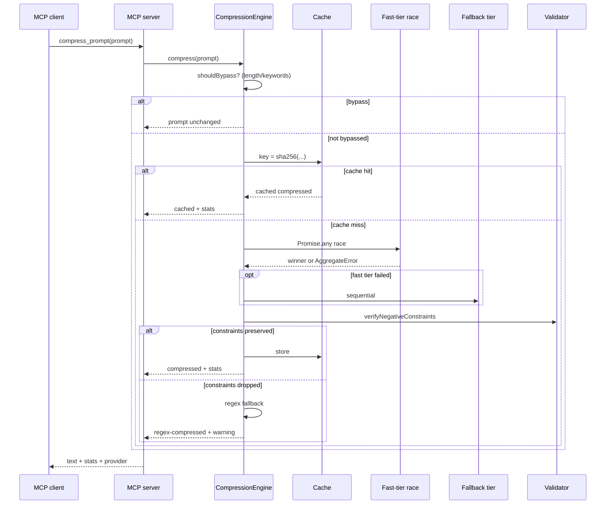

# Architecture

SuperZ has three distribution surfaces backed by a single compression engine:

1. **MCP server** (stdio + HTTP/SSE) — every AI coding tool speaks this.
2. **CLI / universal installer** — detects and configures every MCP client.
3. **VSCode extension** — direct UI commands, bundles the server.

## Module layout

```
src/
  engine/        Core compression logic (pure, unit-tested)
    compress.ts      Orchestrator: cache → race → validate → fallback
    validator.ts     Negative-constraint preservation check
    tokenizer.ts     cl100k_base tokenizer wrapper
    rules.ts         Deterministic regex fallback
    system-prompt.ts Hardened system prompt
  providers/     HTTP wrappers around each backend
    base.ts          OpenAI-compatible call logic, AbortController support
    registry.ts      Filter/order by tier and availability
  config/        Zod-validated config loader
  mcp/           MCP server wiring
    tools.ts         Tool definitions (compress_prompt, stats)
    transports/
      stdio.ts       Default MCP transport
      http.ts        HTTP/SSE transport + REST /v1/compress
  cli/           Commander-based CLI
    commands/        init, doctor, stats, add, remove, serve
    clients/         One writer per MCP client (Claude Code, Cursor, etc.)
    rules-template.ts Generates CLAUDE.md/GEMINI.md/QWEN.md/AGENTS.md
  util/          Cross-cutting infra
    cache.ts         LRU + disk cache
    metrics.ts       Persistent per-provider stats
    logger.ts        Consola wrapper writing to stderr
    json-merge.ts    Idempotent JSON merge for config writes
    paths.ts         Platform-aware path helpers
```

## Request flow



## Safety guarantees

The validator is the single most important component — a prompt compressor
that silently drops "NEVER use Tailwind" is worse than no compressor at all.

1. `extractConstraints` enumerates every negation phrase in the original
   (`not X`, `never X`, `no X`, `!X`, `without X`, …) along with its target
   content tokens.
2. For every candidate compression, `compressedPreserves` requires that each
   target content token appears in the compressed output with a negation
   marker (`!`, `not`, `never`, `no`, `without`, `w/o`, `avoid`, …) within a
   ±6-token window.
3. If a constraint is missing, the candidate is discarded and the engine
   falls back to the deterministic regex compressor, which preserves the
   original text verbatim wherever possible.

## Adaptive racing

`CompressionEngine.orderedFastTier` ranks fast-tier providers by historical
win rate (from `~/.superz/metrics.json`). Cold-start = the declared order.
Losers of each race are aborted via a shared `AbortController` so they don't
keep burning quota after a winner is announced.

## Caching

Keys are `sha256(systemPromptVersion + providerSetVersion + normalizedPrompt)`,
so any change to either the system prompt or the provider set invalidates
the cache automatically.

- Memory tier: `LRUCache` with 500 entries, 7-day TTL (configurable).
- Disk tier: one JSON file per key under `%APPDATA%/SuperZ/cache/` or
  `~/.superz/cache/`.

## Logging

All logs go to `stderr` via `consola`, so MCP stdio (which runs over stdout)
is never polluted. Level controlled by `SUPERZ_LOG`.
